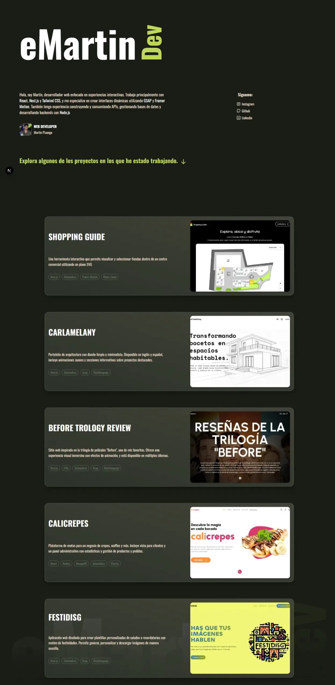

# 💻 eMartin | Portafolio Web

¡Bienvenido a mi portafolio personal!  
Soy **Martin Pizango**, desarrollador web especializado en crear experiencias interactivas modernas y fluidas. Esta página sirve como una vitrina de los proyectos en los que he trabajado y representa mi enfoque en diseño dinámico e interfaces atractivas.

## ✨ Características

- Construido con **Next.js**.
- Estilos modernos con **Tailwind CSS**.
- Animaciones fluidas con **GSAP**.
- Diseño responsive y enfocado en la experiencia de usuario.
- Enlaces a mis redes profesionales: Instagram, GitHub y LinkedIn.

## 🛠️ Tecnologías

- **Next.js**
- **Tailwind CSS**
- **GSAP**

## 📸 Vista previa

